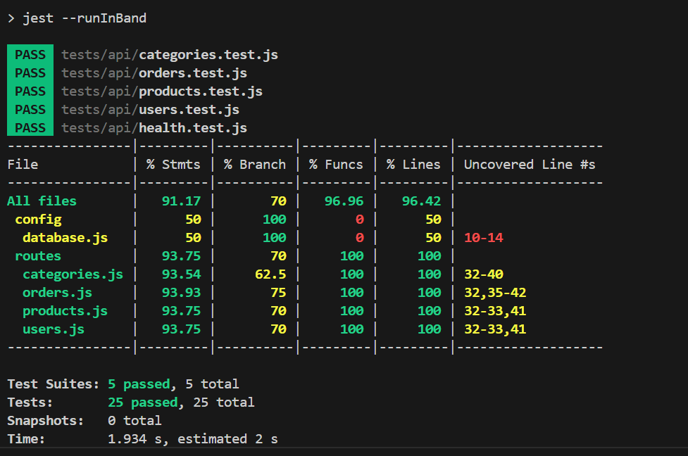

# Shruti API Server

A sample API server built with Node.js, Express, and Sequelize. Includes full CRUD endpoints for users, products, orders, and categories, with comprehensive API tests using Jest, Supertest, and Keploy AI-powered API testing.

## 🚀 Features

- **RESTful API** with full CRUD operations
- **Comprehensive Testing** with Jest, Supertest, and Keploy
- **OpenAPI Schema** for API documentation
- **CI/CD Pipeline** with GitHub Actions
- **AI-Powered API Testing** with Keploy
- **Health Monitoring** and error handling

## 📋 API Endpoints

- `GET /api/users`, `POST /api/users`, `GET /api/users/:id`, `PUT /api/users/:id`, `DELETE /api/users/:id`
- `GET /api/products`, `POST /api/products`, `GET /api/products/:id`, `PUT /api/products/:id`, `DELETE /api/products/:id`
- `GET /api/orders`, `POST /api/orders`, `GET /api/orders/:id`, `PUT /api/orders/:id`, `DELETE /api/orders/:id`
- `GET /api/categories`, `POST /api/categories`, `GET /api/categories/:id`, `PUT /api/categories/:id`, `DELETE /api/categories/:id`
- `GET /api/health` (health check)
- `GET /api/docs` (API documentation)

## 🛠️ Tech Stack

- **Node.js** - Runtime environment
- **Express** - Web framework
- **Sequelize** - ORM (with SQLite for local/testing)
- **Jest** - Unit testing framework
- **Supertest** - API testing library
- **Keploy** - AI-powered API testing platform
- **GitHub Actions** - CI/CD pipeline

## 📖 API Documentation

### OpenAPI Schema
The API is documented using OpenAPI 3.0.3 specification. You can find the complete schema in `openapi.yaml`.

### Interactive Documentation
Once the server is running, you can access:
- API Documentation: `http://localhost:5000/api/docs`
- Health Check: `http://localhost:5000/api/health`

## 🚀 How to Run

### Prerequisites
- Node.js (v14 or higher)
- npm or yarn

### Installation

1. **Clone the repository:**
   ```bash
   git clone <your-repo-url>
   cd Keploy3
   ```

2. **Install dependencies:**
   ```bash
   npm install
   ```

3. **Start the server:**
   ```bash
   npm start
   ```
   The server will run on `http://localhost:5000` by default.

## 🧪 Testing

### Unit Tests
- **Run all tests:**
  ```bash
  npm test
  ```
- **Run tests with coverage:**
  ```bash
  npm run test:coverage
  ```
  Coverage report will be available in the `coverage/` directory.

### API Testing with Keploy

#### Prerequisites for Keploy Testing
1. **Install Keploy:**
   ```bash
   curl -sL https://get.keploy.io | bash
   export PATH=$PATH:$HOME/.keploy/bin
   ```

2. **Set up Keploy API Key:**
   ```bash
   export KEPLOY_API_KEY="your-keploy-api-key"
   export KEPLOY_SERVER_URL="https://api.keploy.io"
   ```

#### Running API Tests

1. **Start the API server:**
   ```bash
   npm start
   ```

2. **Run the test commands:**
   ```bash
   chmod +x ./api-test-commands.sh
   ./api-test-commands.sh
   ```

3. **Run Keploy tests with configuration:**
   ```bash
   keploy test --config keploy.yaml
   ```

#### Test Commands
The `api-test-commands.sh` file contains 25 comprehensive test scenarios covering:
- ✅ All CRUD operations for Users, Products, Orders, and Categories
- ✅ Health check and documentation endpoints
- ✅ Error handling scenarios
- ✅ Performance testing with timing information

## 🔄 CI/CD Pipeline

### GitHub Actions Workflow
The project includes a comprehensive CI/CD pipeline in `.github/workflows/ci-cd.yml` that:

1. **Runs Unit Tests** - Executes Jest tests with coverage
2. **API Testing with Keploy** - Performs comprehensive API testing
3. **Deployment** - Deploys to production (main branch only)

### Pipeline Stages
- **Test Job**: Unit tests and coverage reporting
- **API Test Job**: Keploy API testing with detailed reporting
- **Deploy Job**: Production deployment (triggered on main branch)

### Setup for CI/CD
1. **Add GitHub Secrets:**
   - `KEPLOY_API_KEY`: Your Keploy API key
   - `KEPLOY_SERVER_URL`: Keploy server URL

2. **Push to trigger pipeline:**
   ```bash
   git add .
   git commit -m "Add API testing with Keploy"
   git push origin main
   ```

## 📊 Test Reports

### Coverage Report


### Keploy Test Results
The CI/CD pipeline generates comprehensive test reports including:
- **Test Results**: Pass/fail status for all endpoints
- **Performance Metrics**: Response times and throughput
- **Error Analysis**: Detailed error reporting
- **API Coverage**: Endpoint coverage statistics

## 🔧 Configuration Files

- `openapi.yaml` - OpenAPI 3.0.3 specification
- `keploy.yaml` - Keploy API testing configuration
- `api-test-commands.sh` - Curl commands for manual testing
- `.github/workflows/ci-cd.yml` - GitHub Actions CI/CD pipeline

## 📝 API Testing Features

### Keploy AI-Powered Testing
- **Automated Test Generation** - AI generates test cases from OpenAPI schema
- **Intelligent Assertions** - Smart validation of responses
- **Performance Testing** - Built-in performance metrics
- **Error Simulation** - Tests error handling scenarios
- **Regression Testing** - Detects API changes and regressions

### Test Coverage
- **25 Test Scenarios** covering all endpoints
- **Error Handling** - 404, 400, and validation errors
- **Data Validation** - Email format, price validation, etc.
- **Performance Metrics** - Response time tracking
- **Concurrent Testing** - Multiple requests simultaneously

## 🚀 Deployment

### Production Deployment
The CI/CD pipeline automatically deploys to production when code is pushed to the main branch.

### Environment Variables
- `PORT` - Server port (default: 5000)
- `NODE_ENV` - Environment (development/production)
- `KEPLOY_API_KEY` - Keploy API key for testing
- `KEPLOY_SERVER_URL` - Keploy server URL

## 🤝 Contributing

1. Fork the repository
2. Create a feature branch
3. Make your changes
4. Add tests for new functionality
5. Ensure all tests pass
6. Submit a pull request

## 📄 License

This project is licensed under the MIT License.

---

**Note:** This project uses in-memory data for demonstration and testing. For production, connect Sequelize to a persistent database and implement real models.

## 🔗 Links

- [Keploy Documentation](https://docs.keploy.io/)
- [OpenAPI Specification](https://swagger.io/specification/)
- [GitHub Actions Documentation](https://docs.github.com/en/actions)
- [Jest Testing Framework](https://jestjs.io/)
- [Express.js](https://expressjs.com/) 